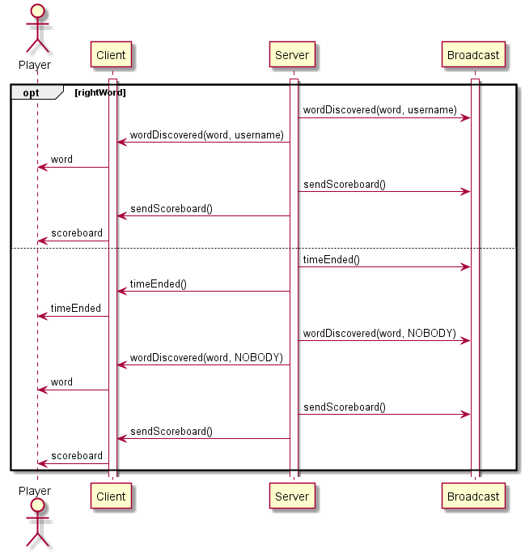

Lo scenario inizia con la parola che viene indovinata da un giocatore oppure se il tempo a disposizione è scaduto. Lo scenario precedente è [game](../game/gameDoc.md).

# Scenario: endGame

Autori: Matteo Forni, Bryan Beffa

## Swim Lane

## Descrizione

### Se la parola viene indovinata:
Se la parola è stata indovinata da un utente, il server comunica a tutti i client che la partita è finita.
Una volta che la parola è stata indovinata e comunicata, il server invia a tutti i client la classifica contenente i punti dei vari giocatori (scoreboard).

### Se il tempo a disposizione scade:
Se il tempo scade e la parola non è stata indovinata da nessun il server comunica che la partita è finita, che nessuno ha indovinato la parola e la parola che era da indovinare.

Infine l'utente, se vorrà giocare un'altra partita, dovrà attendere per l'inizio di essa e ritornerà quindi allo scenario [playerReady](../playerReady/playerReadyDoc.md), altrimenti lascierà il gioco e questo verrà riportato nella chat.

## Tabella del protocollo

| Messaggio     | Direzione | Descrizione | Risposta |
|----------|:-------------:|--------|------------|
| wordDiscovered(word, username) | S -> C S -> B      | Il server comunica ai client che la parola è stata indovinata e l'username di chi ha indovinato | Partita terminata |
|timeEnded()| S -> C S -> B| Il server comunica ai client che il tempo è finito e mostra la parola nascosta|2. Il client non vuole più giocare|
| sendScoreboard()| S -> C S -> B | Il client decide se vuole giocare ancora o meno| 1. Il client vuole rigiocare|
