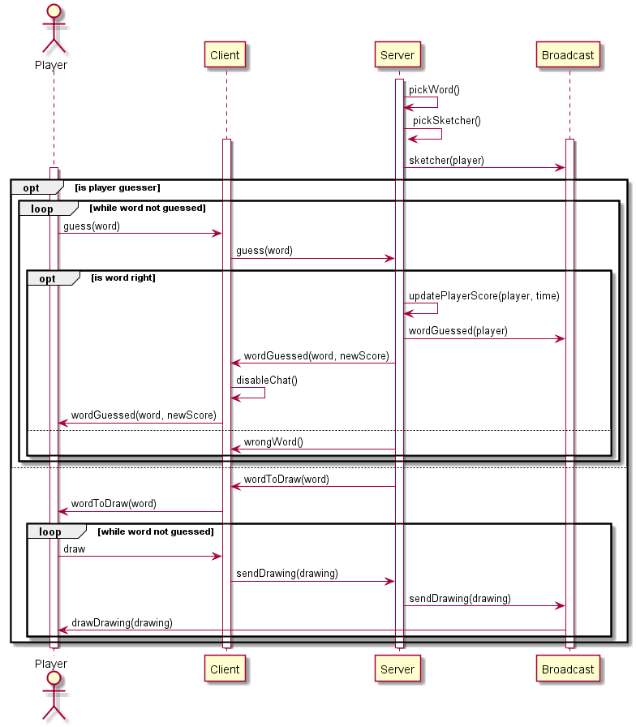

##### [Scenario precedente](../startGame/startGameDoc.md)

Questo scenario inizia dopo la fine dello scenario precedente, ovvero [startGame](../startGame/startGameDoc.md), quando ci sono abbastanza giocatori per iniziare la partita.

## Scenario 4: game

Dopo che la partita viene fatta iniziare dal server, esso decide a caso e da una lista la parola che i giocatori dovranno indovinare e poi se la partita è la prima di una nuova serie viene scelto quale dei giocatori deve disegnare invece di tentare di indovinare in modo casuale dalla lista di giocatori, altrimenti viene designato colui che ha indovinato la parola della partita precedente. In caso durante la partita precedente non ci fossero stati vincitori, viene deciso il prossimo disegnatore in modo casuale. La decisione viene comunicata a tutti i client, di conseguenza tutti i client che non sono associati al giocatore che disegna saranno client di giocatori che indovinano la parola.

Ogni volta che il disegnatore disegna un tratto, esso viene mandato al server che lo propaga a tutti i client che lo disegnano sulla propria area di disegno, in modo che tutti i client ricevano il disegno completo del disegnatore e tutti i giocatori possano tentare di indovinare la parola.

Infatti ognuno degli indovinatori può scrivere nella chat un tentativo di indovinare la parola che viene mostrato a tutti gli altri giocatori: se il tentativo risulta essere uguale alla parola estratta a caso dal server all'inizio della partita, il punteggio del giocatore che ha indovinato la parola viene aggiornato e il fatto viene comunicato al client di quel giocatore che si occupa di disabilitare la chat in modo che esso non possa aiutare gli altri ancora in gioco e gli mostra un messaggio con la parola indovinata e il suo nuovo punteggio. Se, invece, il tentativo dovesse essere diverso dalla parola estratta, questo viene comunicato al client e il gioco continua.

### Protocollo di comunicazione

| Messaggio                | Direzione         | Descrizione                                                     | Risposta                                           |
| :------------------- | :------------------- | :-------------------------------------------------------------- | :-------------------------------------------------- |
| sketcher(player)     | Server --> Client    | Comunicazione a tutti i client del giocatore che deve disegnare |                                                     |
| guess(word)          | Client --> Server    | Tentativo di indovinare la parola estratta dal server           | 1: wordGuessed(player, word, score); 2: wrongWord() |
| wordToDraw(word)     | Server --> Client    | Comunicazione al client del disegnatore quale sia la sua parola |                                                     |
| sendDrawing(drawing) | Client --> Server    | Invio del disegno del giocatore al server                       |                                                     |
| sendDrawing(drawing) | Server --> Broadcast | Invio del disegno del giocatore a tutti i client                |                                                     |