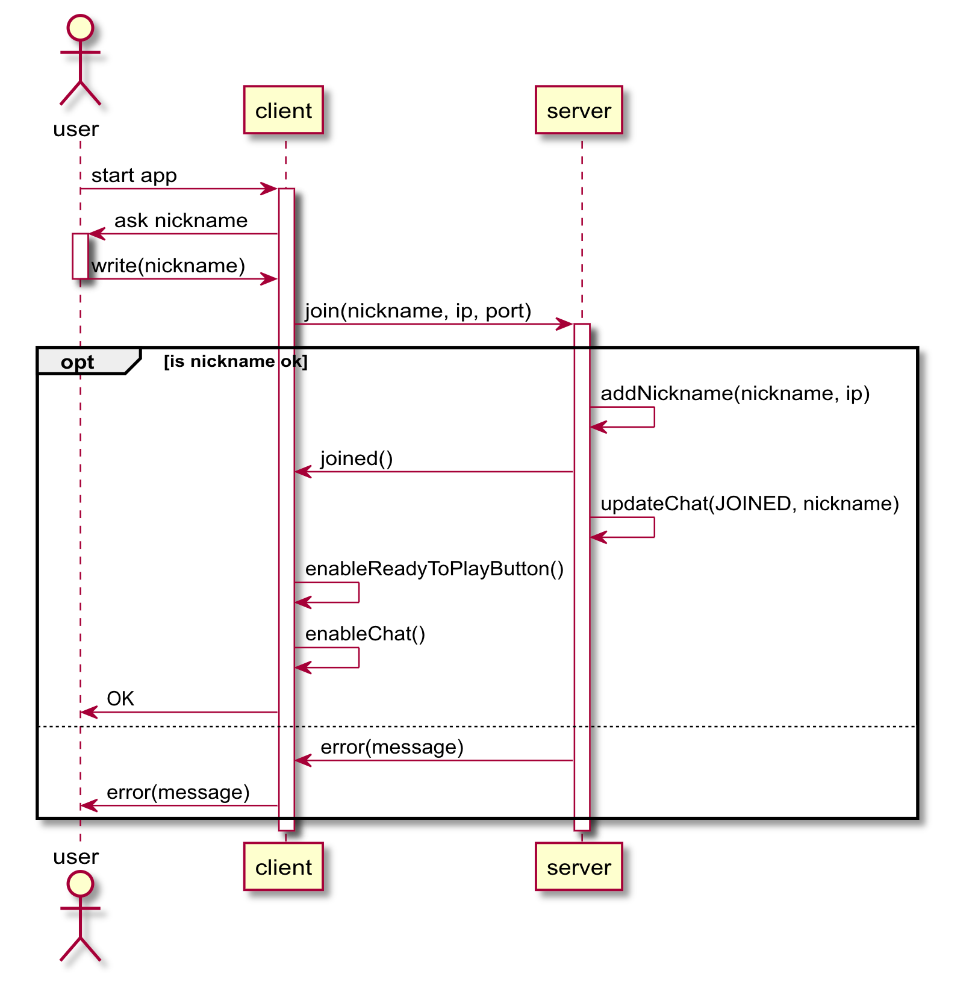

Lo scenario inizia con l'avvio dell'applicazione da parte dell'utente.

# Scenario: Join Room

Autori: Jari Naeser, Giulio Bosco

## Swim Lane

## Descrizione

### Se il nickname immesso rispetta le convenzioni
Se il nickname immesso rispetta tutte le convenzioni ed i vincoli del server viene aggiunto ad una lista (lato server) contenente tutti i nickname pronti per giocare e viene messo in attesa.
Oltre a ciò la sua chat viene aggiornata ed attivata, rendendo possibile la comunicazione con altri player.
Se tutto è andato a buon fine l'utente riceve un messaggio che si è collegato con successo al server.

### Se il nickname immesso non rispetta le convenzioni
Se il nickname immesso non rispetta le convenzioni ed i vincoli del server all'utente viene ritornato un messaggio d'errore.
Per riprovare bisogna immettere un nuovo nome che rispetti le convenzioni.

## Tabella del protocollo

|Command|Direction|Description|Possible Response|
|-|-|-|-|
|Join(Nickname)|c&rarr;s|Client makes a request to join the server with the nickname given as a parameter|Joined() error(message)|
|Joined()|c&rarr;s|Confirms that the client joined the server.|-|
|Error(message)|c&rarr;s|Returns an error with it’s relative message.|-|

[Scenario successivo](../playerReady/playerReadyDoc.md)
