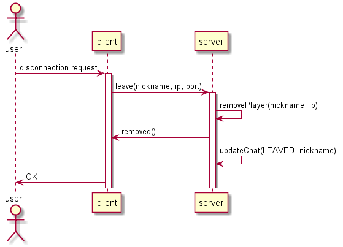

Lo scenario inizia con l'utente che preme un pulsante per disconnettersi dalla partita in corso oppure se l'utente riscontra problemi di connessione o spegne la macchina.  
Lo scenario precedente è [game](../game/gameDoc.md).

# Scenario: playerDisconnected

Autori: Gabriele Alessi, Mattia Ruberto

## Swim Lane

## Descrizione

### Disconnessione

Il client viene disconnesso quando l'utente preme l'apposito pulsante o ci sono problemi di connessione o l'arresto della macchina. Quindi il server rimuove il giocatore dalla sessione tramite nickname e indirizzo IP.

L'utente preme il pulsante (player disconnected) e il client chiede al server di lasciare la partita (leave()). Quindi se va tutto bene il server rimuove il player (removePlayer()) dal sistema e invia un check al client (removed()). Infine il server aggiorna la chat mostrando che il player ha appunto lasciato la partita (updateChat()) e manda l'OK all'utente.

### Rimozione

Se l'utente si è disconnesso correttamente gli viene inviato un acknowledgement dal server che nel frattempo aggiorna la chat per comunicare la disconnessione appena avvenuta agli altri utenti in sessione.

## Tabella del protocollo

| Message | Direction | Description | Reply |
| - | - | - | - |
| leave(nickname, ip, port) | c &rarr; s | Client fa una richiesta di disconessione al server. | - |        
| removed() | s &rarr; c | Il server ritorna al client la conferma che è stato rimosso. | - |