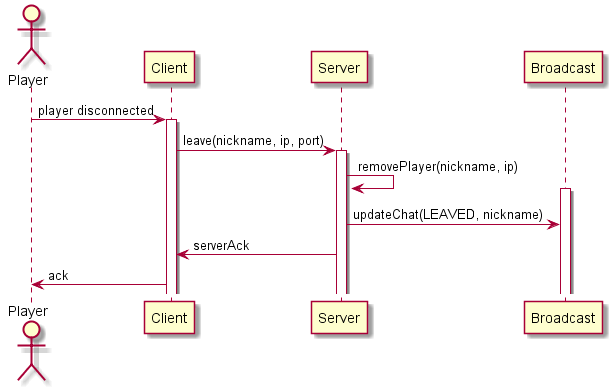

Lo scenario inizia con l'utente che preme un pulsante per disconnettersi dalla partita in corso oppure se l'utente riscontra problemi di connessione o spegne la macchina.  
Lo scenario precedente è [game](../game/gameDoc.md).

# Scenario: playerDisconnected

Autori: Mattia Ruberto, Gabriele Alessi

## Swim Lane

## Descrizione

### Disconnessione

Il client viene disconnesso quando l'utente preme l'apposito pulsante o ci sono problemi di connessione o l'arresto della macchina. Quindi il server rimuove il giocatore dalla sessione tramite nickname e indirizzo IP.

### Rimozione

Se l'utente si è disconnesso correttamente gli viene inviato un acknowledgement dal server che nel frattempo aggiorna la chat per comunicare la disconnessione appena avvenuta agli altri utenti in sessione.

### Nuova partita

L'utente riceve l'OK definitivo e torna nel menu in cui può dichararsi pronto per un'altra partita ([playerReady](../playerReady/playerReadyDoc.md)). Altrimenti se il sistema è stato spento, l'utente dovrà ricominciare da capo avviando l'applicazione ([joinRoom](../joinRoom/joinRoomDoc.md)).

## Tabella del protocollo

| Messaggio | Direzione | Descrizione | Risposta |
|:--------|:----------|:------------|:------|
| leave(nickname, ip, port) | C &rarr; S | Il client fa una richiesta di disconessione al server. | - |        
| updateChat(LEAVED, nickname) | S &rarr; B | Il server comunica nella chat (agli altri client) che l'utente ha lasciato la partita. | - |