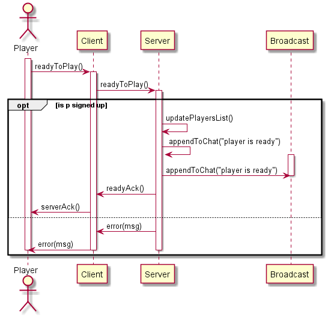

## Scenario 2: giocatore è pronto - analisi
Questo scenario inizia quando un giocatore si è già registrato su un server e ha premuto il pulsante per segnalare al server e agli altri giocatori che è pronto per iniziare il gioco.

Una volta premuto il pulsante "pronto", il client invia un messaggio al server segnalando che il giocatore è pronto. Se il giocatore è effettivamente registrato nel server, il server aggiorna la sua lista di giocatori, impostandolo su "pronto", e aggiunge un messaggio alla chat per permettere a tutti di vederlo. Successivamente, invia un messaggio di conferma al client, che viene poi inoltrato al giocatore.
Tuttavia, se il giocatore non è registrato, invia semplicemente un messaggio di errore al client, che viene inoltrato al giocatore.

### Communication protocol

| Message | Direction | Description | Reply
| :------------- | :------------- | :------------- | :------------- |
| readyToPlay() | C --> S | sent by the client to indicate that they are ready to play | 1 = OK; 2 = Error: player not registered (msg) |
