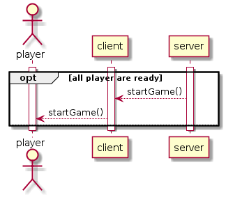

## Scenario 3: ci sono abbastanza giocatori, inizia la partita - analisi

Questo scenario inizia quando ci sono abbastanza giocatori per iniziare la partita e i giocatori hanno premuto il pulsante per segnalare al server e agli altri giocatori di essere pronti e che quindi il gioco per iniziare.

Una volta che ci sono abbastanza giocatori che hanno premuto il pulsante "pronto", la partita può iniziare, dopo che la lista dei giocatori è stata aggiornata dal server al client verrà mandato un messaggio, che segnalerà l'inizio della partita. A questo punto la partita sarà iniziata.
Successivamente la chat di gioco viene aggiornata nel server.

### Communication protocol

| Messaggio | Direzione | Descrizione | Risposta
| :------------- | :------------- | :------------- | :------------- |
| readyToPlay() | C --> S | Il client è pronto per giocare | 1 = OK; 2 = Error |
| updateList() | S --> S | Il server aggiorna la lista | - |
| startGame() | S --> C | Il server avvisa il client che il gioco è iniziato | - |
| updateChat() | S --> S | Il server aggiorna la chat | - |
| updateList() | S --> C | Errore nell' del gioco | - |
