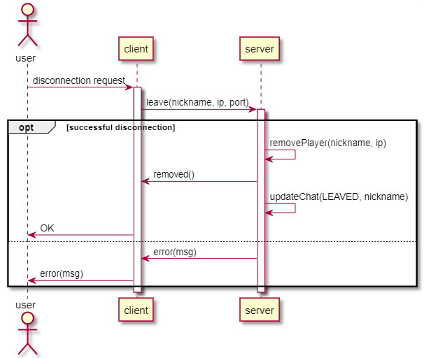

### Mattia Ruberto e Gabriele Alessi 19.03.2019

# Scenario 4: Disconnessione utente

### Nello scenario 4 il giocatore si disconnete da una partita in corso.

 
## Procedura:  
 L'utente preme il pulsante (disconnection request) e il client chiede al server di lasciare la partita (leave()). Quindi se va tutto bene il server rimuove il player (removePlayer()) dal sistema e invia un check al client (removed()). Infine il server aggiorna la chat mostrando che il player ha appunto lasciato la partita (updateChat()) e manda l'OK all'utente. Se invece ci sono problemi con la disconnessione verrà mandato un messaggio di errore al client e quindi all'utente (error()).

### Tabella dei protocolli di comunicazione

| Message                     | Direction     | Description                                                                            |   Reply                 |
|:----------------------------|:--------------|:---------------------------------------------------------------------------------------|:------------------------|
| leave(nickname, ip, port)   | c --> s       | Client fa una richiesta di disconessione al server.                                    | -                       |        
| removed                     | s --> c       | Il server ritorna al client la conferma che è stato rimosso.                           | -                       | 

